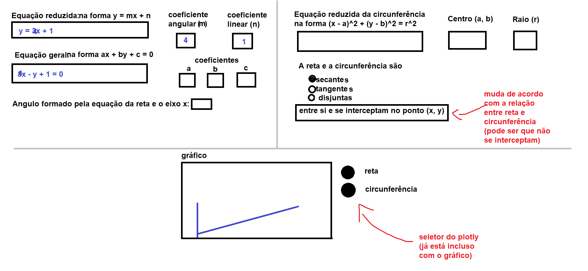

# Math Visualization

Repositório para organizar o código-fonte do projeto da Feira de Ciências do CTISM 2022.

## Resumo

O software desenvolvido aqui é um visualizador de funções matemáticas lineares e função do círculo, desenvolvido usando 
a biblioteca dash, escrita em Python. O software é majoritariamente escrito em Python, com as projeções sendo geradas 
em HTML.

## Instalação

1. Clone este repositório na sua máquina
2. Crie um ambiente virtual e instale as dependências:

   `conda create --name math --file requirements.txt --yes`

   (mais sobre ambientes virtuais [aqui](
   https://github.com/CTISM-Prof-Henry/pythonEssentials/blob/main/chapters/venvs.md#criando-pela-linha-de-comando))

3. Ative o ambiente virtual com `conda activate math`
4. Instale a biblioteca dash usando pip: `pip install dash==2.6.*`
5. Rode os scripts de teste pela linha de comando para verificar se tudo foi instalado corretamente, e.g. 
   `python teste_plotly.py`
6. **Nota:** o `teste_dash.py` não abre uma janela ou página Web, mas sim
   informa um link na linha de comando (por exemplo, `http://127.0.0.1:8050/`) que você precisa copiar-e-colar no 
   seu navegador para abrir a página. Não se esqueça de, depois de rodar o código, pressionar `CTRL + C` para parar
   a execução do script `teste_dash.py`.

## Checklist de atividades

**Dica 1:** Para marcar um dos _checkboxes_ abaixo, edite o arquivo em Markdown
e troque de `[ ]` para `[x]`.

**Dica 2:** Escreva o seu nome entre parênteses para informar que vai fazer
aquela atividade.

1. [ ] (Henry) Organizar tudo.
2. [ ] (Bruno) Implementar função para converter da equação reduzida da reta para a equação geral.
      * Dica: pesquise a função `eval` para validar expressões matemáticas
3. [ ] (aline) Implementar função para converter da equação geral da reta para a equação reduzida.
      * Dica: pesquise a função `eval` para validar expressões matemáticas
4. [ ] (Tales) Implementar função que, dada uma equação reduzida da reta, informa os coeficientes angular e linear.
5. [ ] (Liza) Implementar função que, dada uma equação geral da reta, informa os coeficientes a, b e c.
6. [ ] () Implementar função que, dada uma equação de reta (geral ou reduzida), informa o ângulo formado com o eixo x.
7. [ ] () Implementar uma função que, dada uma equação da circunferência, informa o centro, e o raio da mesma.
8. [ ] () Implementar função que, dadas duas equações, uma de reta e uma de circunferência, informa se ambas são
       secantes, tangentes ou não se interceptam. Caso sejam secantes e tangentes, informar em qual(quais) ponto(s)
       isto ocorre.
9. [ ] (Luize) Implementar layout da página HTML utilizando dash.
      * Dica: https://dash.plotly.com/dash-core-components
10. [ ] (Henry) implementar gráfico da reta e da circunferência.

## API

Esta seção detalha, de acordo com os itens descritos no [Checklist de atividades](#checklist-de-atividades), qual 
deve ser a entrada e a saída esperada de cada uma das funções implementadas.

Por exemplo, para o primeiro item da lista, devemos implementar uma função que recebe uma string, e retorna uma string
também. Em Python, essa função teria essa forma:

```python
def reta_reduzida_para_geral(reduzida: str) -> str:
   return 'ax + by + c = 0'
```

Perceba que esta função recebe uma variável como parâmetro (`reduzida`, do tipo `str`), e retorna uma variável do tipo
`str` também. Por isso, a **Entrada** na tabela abaixo é uma `str`, e a **saída** é uma `str` também.

É importante atentar-se esta tabela pois alguns colegas precisarão do retorno de uma função que você irá implementar,
para implementar as suas próprias funções. O tipo de retorno influenciará na maneira como os colegas farão o trabalho
deles.

| Item da checklist |       Entrada |                                         Saída |
|:------------------|--------------:|----------------------------------------------:|
| 2                 |           str |                                           str |
| 3                 |           str |                                           str |
| 4                 |           str |                                  float, float |
| 5                 |           str |                           float, float, float |
| 6                 |           str |                                         float |
| 7                 |           str |                    tuple(float, float), float |
| 8                 |           str | str, tuple(float, float), tuple(float, float) |
| 9                 | não se aplica |                                 não se aplica |
| 10                | não se aplica |                                 não se aplica |


## Link da reunião 

[link](https://drive.google.com/file/d/1jte5aDalkYnU4661NR-E6pZAd0d8ITp8/view?usp=sharing)

## Bibliografia

* [Documentação Dash (em inglês)](https://dash.plotly.com/)
* [Documentação plotly (em inglês)](https://plotly.com/python/)
   * A página de documentação contém códigos-fonte de exemplo para diversos tipos de projeção
* [API reference plotly (em inglês)](https://plotly.com/python-api-reference/)
   * A documentação da API contém a documentação de diversas funções da biblioteca plotly
* [Galeria de exemplo dash (em inglês)](https://dash-example-index.herokuapp.com/)

## Desenho da interface gráfica


